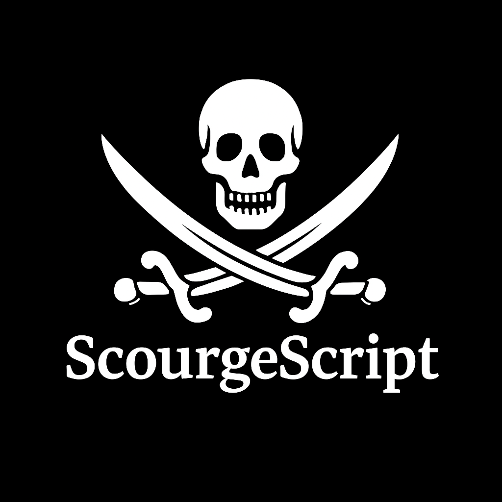

# Scourge Script Project

A programming language designed to aid programming language development by using metaprogramming.

## How?

By running compiled scourge code on a binary interpeter, being called 'vessel', it is possible to call the compiler through the interpreter.
In doing so, it is possible to generate, compile, integrate, run and get results back from code on the fly.

This allows for things like:
- Parser generators that are made and used at run time arbitrarily.
- Making the scourge script programming language able to be its own build scripting platform.
- Building complex pieces of code by script and not by hand.

The winds and the waves never slumber...

## Build

> make
